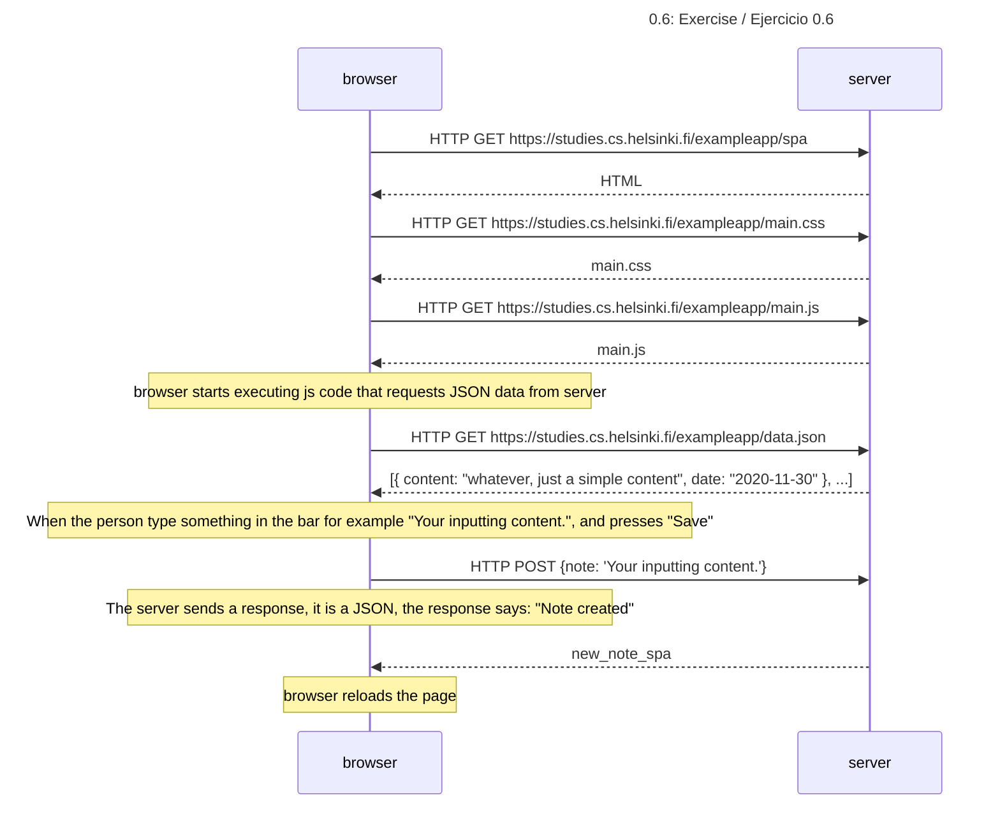

# 0.6: Exercise / Ejercicio 0.6

```mermaid
sequenceDiagram
  Title: 0.6: Exercise / Ejercicio 0.6

    browser->>server: HTTP GET https://studies.cs.helsinki.fi/exampleapp/spa
    server-->>browser: HTML
    browser->>server: HTTP GET https://studies.cs.helsinki.fi/exampleapp/main.css
    server-->>browser: main.css
    browser->>server: HTTP GET https://studies.cs.helsinki.fi/exampleapp/main.js
    server-->>browser: main.js

    note over browser: browser starts executing js code that requests JSON data from server

    browser->>server: HTTP GET https://studies.cs.helsinki.fi/exampleapp/data.json
    server-->>browser: [{ content: "whatever, just a simple content", date: "2020-11-30" }, ...]

    note over browser: When the person type something in the bar for example "Your inputting content.", and presses "Save" 
    browser->>server: HTTP POST {note: 'Your inputting content.'}
    
    note over browser: The server sends a response, it is a JSON, the response says: "Note created"
    server-->>browser: new_note_spa

    note over browser: browser reloads the page
```
